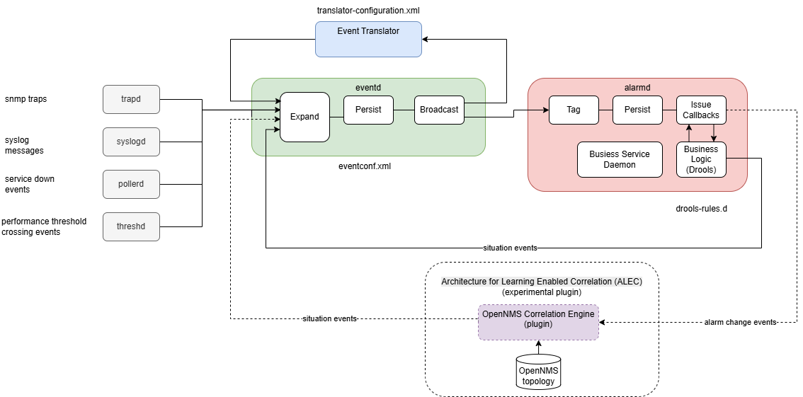

[Main Menu](../README.md) | [Session 4](../session4/README.md)

# Session 4 - Database Event and Alarm Enrichment

## Introduction

The event and alarm processing path in OpenNMS is illustrated below.

Events can be generated from SNMP traps.
in [Session 3](../session3/README.md) we looked at various techniques for creating event and alarm configurations using SNMP Mibs using masks in `eventconf.xml`.

Events can also be generated from other sources such as syslogs, service pollers and performance threshold crossings detected when gathering performance data.
We will look more at these sources in a future session. 

Often in a real world network management situation it is necessary to further modify or 'enrich` the events and alarms to provide more meaningful service impact information to users.

One of the most useful tools is the `Event Translator` which can generate new events based upon an existing event combined with other data, most often derived from the OpenNMS database. 

In [Exercise-4-1](../session4/Exercise-4-1.md) we will look at the OpenNMS Database and the Event Translator.

In [Exercise-4-2](../session4/Exercise-4-2.md) we will create a real event translator example for our smart motorway.

We looked in [Session 2](../session2/README.md) at how `Business Service Monitoring` can build a graph of services which allows us to determine the business impact of a monitored service failure and create business service alarms.
`Business Service Monitoring` is useful and quite easy to use but it is limited in that you need to create a business service graph for every business service instance.

OpenNMS provides an alarm correlation framework which can allow structured rules or external machine learning plugins to detect `situations` which group together the root cause and sympathetic alarms for an incident. 

The [Architecture for Learning Enabled Correlation (ALEC)](https://docs.opennms.com/alec/3.0.3/about/welcome.html) machine learning framework is quite experimental and not recommended for production use. 
We will not cover ALEC further in this training. 

However, those with some programming experience can create drools rules to change the alarm lifecycle and also to correlate alarms into situations. 
It should be emphasised that creating and testing rules is not easy but is included here to ilustrate what can be achieved with a bit of effort.

In [Exercise-4-3](../session4/Exercise-4-3.md) we will look at how Drools Rules can be used to modify the alarm behaviour.
